# CRM-PRO -A Modern, AI-Powered Customer Relationship Management System

<div align="center">
  


</div>

---

## Overview

CRM-PRO is an advanced Customer Relationship Management system built with a microservices architecture, leveraging machine learning for intelligent customer insights. The platform provides real-time customer recommendations and churn prediction to help businesses make data-driven decisions.

---

## Features

- 🎯 **Intelligent Recommendations** - K-Means clustering-based customer segmentation
- 📊 **Churn Prediction** - SVM-powered customer churn analysis
- 🎨 **Modern UI** - Beautiful 3D visualizations with React Three.js and React Fiber
- 🔐 **Secure Authentication** - JWT-based auth system
- 📧 **Email Service** - Automated email notifications via Brevo
- 🐳 **Containerized** - Full Docker and Compose support
- 📱 **Responsive Design** - Mobile-first design with shadcn/ui components
- 🔄 **Real-time Updates** - Live data synchronization
- 📈 **Analytics Dashboard** - Comprehensive business metrics
- ⚡ **High Performance** - Optimized for speed and scalability

---

## Tech Stack

### Frontend
<div align="center">

| Technology | Description |
|------------|-------------|
|  | UI Library |
|  | 3D Graphics |
|  | React renderer for Three.js |
|  | UI Component Library |
|  | Styling |
|  | Build Tool |

</div>

### Backend
<div align="center">

| Technology | Description |
|------------|-------------|
|  | REST API Framework |
|  | Database |
|  | ODM |
|  | Authentication |
|  | Email Service |

</div>

### ML Service
<div align="center">

| Technology | Description |
|------------|-------------|
|  | Python Web Framework |
|  | ML Library |
|  | Recommendation System |
|  | Churn Prediction |
|   | Data Processing |

</div>

### DevOps
<div align="center">

| Technology | Description |
|------------|-------------|
|  | Containerization |
|  | Container Orchestration |
|  | Frontend Hosting |
|  | Backend & ML Hosting |
|  | Service Monitoring |

</div>

---

## Architecture

<div align="center">

### System Architecture

```mermaid
graph TB
    %% === Actor ===
    user(["User / Customer"])
    
    %% === Frontend Cluster ===
    subgraph frontend["Frontend - React + Vite + Axios"]
        react_ui["<b>React UI Layer</b><br/>━━━━━━━━━━━━━━<br/>Pages & Components<br/>Local State - useState, Context<br/>API Client - Axios, Shadcn/UI, R3F<br/>━━━━━━━━━━━━━━<br/>src/pages, src/components"]
    end
    
    %% === Backend Cluster ===
    subgraph backend["Backend API - Node.js + Express"]
        api_gateway["<b>API Entrypoint</b><br/>━━━━━━━━━━━━━━<br/>app.js, index.js<br/>━━━━━━━━━━━━━━<br/>Express Server"]
        middleware["<b>Middleware</b><br/>━━━━━━━━━━━━━━<br/>Auth - JWT, Error Handling, Multer<br/>━━━━━━━━━━━━━━<br/>src/middleware"]
        controllers["<b>Controllers</b><br/>━━━━━━━━━━━━━━<br/>User, Customer, Order, Segment Logic<br/>━━━━━━━━━━━━━━<br/>src/controllers"]
        models["<b>Models - Mongoose</b><br/>━━━━━━━━━━━━━━<br/>User, Customer, Segment, Orders<br/>━━━━━━━━━━━━━━<br/>src/models"]
        utils["<b>Utilities</b><br/>━━━━━━━━━━━━━━<br/>Email, JWT, APIResponse<br/>━━━━━━━━━━━━━━<br/>src/utils"]
        file_storage["<b>File Storage</b><br/>━━━━━━━━━━━━━━<br/>/uploads<br/>━━━━━━━━━━━━━━<br/>Multer Handled"]
    end
    
    %% === ML Microservice Cluster ===
    subgraph ml_service["ML Microservice - FastAPI + scikit-learn"]
        ml_api["<b>ML API - FastAPI</b><br/>━━━━━━━━━━━━━━<br/>/predict_churn, /recommend<br/>━━━━━━━━━━━━━━<br/>venv, uvicorn"]
        ml_logic["<b>ML Logic & Models</b><br/>━━━━━━━━━━━━━━<br/>Churn Prediction - SVM<br/>Recommendation - K-Means<br/>━━━━━━━━━━━━━━<br/>scikit-learn, pandas"]
    end
    
    %% === Data Cluster ===
    subgraph data["Data Layer - MongoDB Atlas"]
        db_mongo[("<b>Primary Database</b><br/>━━━━━━━━━━━━━━<br/>MongoDB Atlas<br/>━━━━━━━━━━━━━━<br/>Collections: users, customers, orders")]
    end
    
    %% === External Services Cluster ===
    subgraph external["External Services - SaaS"]
        google_oauth["<b>Google OAuth</b><br/>━━━━━━━━━━━━━━<br/>Used for Authentication"]
        email_service["<b>Brevo - Sendinblue</b><br/>━━━━━━━━━━━━━━<br/>Transactional Email Service"]
    end
    
    %% === Cloud & Docker Infrastructure Cluster ===
    subgraph cloud["Cloud Infrastructure, Containerization & Deployment"]
        docker_engine["<b>Docker Engine</b><br/>━━━━━━━━━━━━━━<br/>Build & Run Containers<br/>━━━━━━━━━━━━━━<br/>docker build, docker run"]
        docker_compose["<b>Docker Compose</b><br/>━━━━━━━━━━━━━━<br/>Multi-container Orchestration<br/>━━━━━━━━━━━━━━<br/>docker-compose.yml"]
        vercel["<b>Vercel</b><br/>Frontend Hosting"]
        render["<b>Render</b><br/>Backend + ML Services"]
        mongo_atlas["<b>MongoDB Atlas</b><br/>Cloud Database"]
    end
    
    %% === User Flow Connections ===
    user -->|"Interacts via Browser"| react_ui
    react_ui -->|"REST API Calls - HTTPS"| api_gateway
    
    %% === Backend Internal Flow ===
    api_gateway --> middleware
    middleware --> controllers
    controllers --> models
    controllers --> utils
    controllers -->|"Save / Load Files"| file_storage
    
    %% === ML Service Flow ===
    ml_api --> ml_logic
    
    %% === Cross-Service Connections ===
    api_gateway -->|"Internal API - REST/gRPC"| ml_api
    models -->|"CRUD Operations - Mongoose"| db_mongo
    utils -->|"Send Email via API"| email_service
    controllers -->|"OAuth Redirect"| google_oauth
    
    %% === Docker / Deployment Connections ===
    react_ui -.->|"Containerized with"| docker_compose
    api_gateway -.->|"Containerized with"| docker_compose
    ml_api -.->|"Containerized with"| docker_compose
    db_mongo -.->|"Networked via"| docker_compose
    
    docker_compose --> docker_engine
    docker_compose -.->|"Deploys to"| vercel
    docker_compose -.->|"Deploys to"| render
    db_mongo -.->|"Hosted on"| mongo_atlas
    
    %% === Styling ===
    classDef userStyle fill:#dbeafe,stroke:#60a5fa,stroke-width:2px,color:#1e3a8a
    classDef frontendStyle fill:#eff6ff,stroke:#93c5fd,stroke-width:2px
    classDef backendStyle fill:#ecfdf5,stroke:#86efac,stroke-width:2px
    classDef mlStyle fill:#faf5ff,stroke:#e9d5ff,stroke-width:2px
    classDef dataStyle fill:#fefce8,stroke:#facc15,stroke-width:2px
    classDef externalStyle fill:#f8fafc,stroke:#e2e8f0,stroke-width:2px
    classDef cloudStyle fill:#f1f5f9,stroke:#38bdf8,stroke-width:2px

    class user userStyle
    class react_ui frontendStyle
    class api_gateway,middleware,controllers,models,utils,file_storage backendStyle
    class ml_api,ml_logic mlStyle
    class db_mongo dataStyle
    class google_oauth,email_service externalStyle
    class docker_engine,docker_compose,vercel,render,mongo_atlas cloudStyle

```



</div>

### Microservices Architecture

The application follows a microservices architecture pattern:

1. **Frontend Service** - React SPA with 3D visualizations
2. **Backend Service** - Express.js REST API handling business logic
3. **ML Service** - FastAPI service for machine learning predictions

Each service runs in its own Docker container and can be scaled independently.

---

### User Manual 

You can view the CRM-Pro User Guide PDF directly below:


 [](https://drive.google.com/file/d/1kTwWPq2kocIpp5Gw6xWta0k_rqXZ_HZ1/view?usp=sharing)

### Demo Video

[](https://youtu.be/8sh6Yt9_3tM)

---

## Local Setup

### 1️⃣ Clone the Repository

```bash
git clone https://github.com/yourusername/CRM_Pro.git
cd CRM_Pro
```

### 2️⃣ Backend Setup

```bash
cd CRM_Backend

# Install dependencies
npm install

# Create .env file

# Start the server
npm run dev
```

### 3️⃣ ML Service Setup

```bash
cd ../ML_Service

# Create virtual environment
python -m venv venv
source venv/bin/activate  # On Windows: venv\Scripts\activate

# Install dependencies
pip install -r requirements.txt

# Create .env file

# Start the service
uvicorn main:app --reload --port 8001
```

### 4️⃣ Frontend Setup

```bash
cd ../CRM_Frontend

# Install dependencies
npm install

# Start development server
npm run dev
```

### 5️⃣ Access the Application

- **Frontend**: http://localhost:5173
- **Backend API**: http://localhost:8000
- **ML Service**: http://localhost:8001
---

## Docker Setup

### One-Command Setup

```bash
# Clone the repository
git clone https://github.com/yourusername/CRM_Pro.git
cd CRM_Pro

# Create environment files (see Environment Variables section)
# Then run:
docker-compose up --build
```

### Individual Service Setup

```bash
# Build all services
docker-compose build

# Start all services
docker-compose up

# Start in detached mode
docker-compose up -d

# View logs
docker-compose logs -f

# Stop all services
docker-compose down

# Remove volumes (clean slate)
docker-compose down -v
```
---

## Environment Variables

### Backend (.env)

```env
MONGODB_URI=
PORT=8000
GOOGLE_CLIENT_ID=
REFRESH_TOKEN_SECRET=
ACCESS_TOKEN_SECRET=
OPEN_ROUTER=
CORS_ORIGIN=http://localhost:5173
BREVO_HOST=smtp-relay.brevo.com
BREVO_PORT=587
BREVO_USER=
BREVO_API_KEY=
CLIENT_URL=http://localhost:5173
ML_SERVICE_URL=
DOCKER_ENV=false
```

### ML Service (.env)

```env
CHURN_MODEL_PATH=models/churn_model.pkl
RECOMMENDER_MODEL_PATH=models/recommender_pipeline.pkl
RECOMMENDATION_MAP_PATH=models/recommendation_map.json
PORT=8001
```
---

## Deployment

### Frontend (Vercel)

```bash
# Install Vercel CLI
npm i -g vercel

# Deploy
cd CRM_Frontend
vercel --prod

# Configure environment variables in Vercel dashboard
```

### Backend (Render)

1. Create a new **Web Service** on Render
2. Connect your GitHub repository
3. Configure:
   - **Build Command**: `npm install`
   - **Start Command**: `npm start`
   - **Environment**: Add all backend env variables
4. Deploy

### ML Service (Render)

1. Create a new **Web Service** on Render
2. Connect your GitHub repository
3. Configure:
   - **Build Command**: `pip install -r requirements.txt`
   - **Start Command**: `uvicorn main:app --host 0.0.0.0 --port $PORT`
   - **Environment**: Add all ML service env variables
4. Deploy

### Database (MongoDB Atlas)

1. Create a free cluster on [MongoDB Atlas](https://www.mongodb.com/atlas)
2. Whitelist all IPs (0.0.0.0/0) for Render services
3. Copy connection string and update `MONGODB_URI` in all services

### Domain (GoDaddy)

1. Purchase domain from GoDaddy
2. Add DNS records:
   ```
   Type: CNAME
   Name: @
   Value: cname.vercel-dns.com
   ```
3. Configure custom domain in Vercel dashboard

---

## Monitoring

### UptimeRobot Setup

1. Create account on [UptimeRobot](https://uptimerobot.com)
2. Add monitors for:
   - Frontend: `https://yourapp.com`
   - Backend: `https://your-backend.render.com/health`
   - ML Service: `https://your-ml-service.render.com/health`
3. Configure alert contacts (email, SMS, Slack)
4. Set monitoring interval to 5 minutes
---

## License

This project is licensed under the MIT License - see the [LICENSE](LICENSE) file for details.

---

## Author

- **Vikas** - *Full Work* - [@Vd7905](https://github.com/Vd7905)

---

</div>
